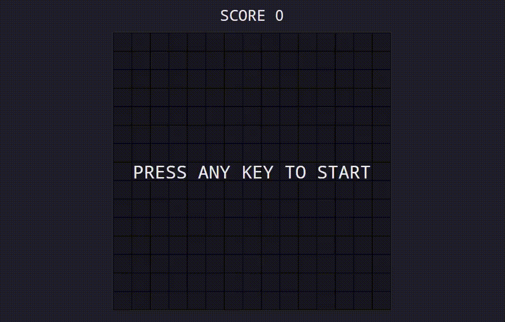

# Snake game

Snake - игра, в которой вы управляете змейкой и ваша задача - собрать как можно больше предметов, чтобы увеличить длину змеи и набрать максимальное количество очков.

В игре Snake используется графический интерфейс WPF (Windows Presentation Foundation), что обеспечивает визуально привлекательное и интерактивное игровое окно.

Правила игры просты: змейка начинает движение с определенной точки на игровом поле. Ваша задача - управлять змейкой, используя клавиши управления (например, стрелки), чтобы она двигалась вверх, вниз, влево или вправо. Змейка перемещается по игровому полю, и каждый раз, когда она съедает предмет, ее длина увеличивается.

Цель игры - набрать как можно больше очков, собирая предметы. Когда змейка съедает предмет, он исчезает, и ваш счет увеличивается. Однако вы должны быть осторожны, чтобы не столкнуться с самой собой или со стенами игрового поля, иначе игра заканчивается.

Игра сделана на основе данного видео https://youtu.be/uzAXxFBbVoE
